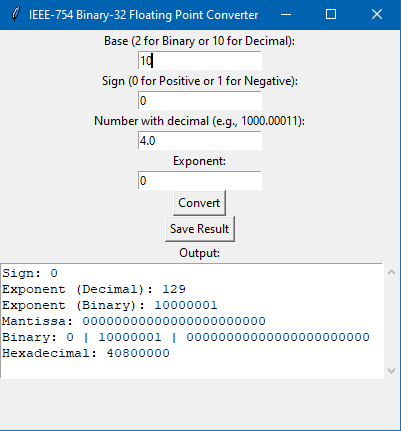

## CSARCH2 Simulation Project: IEEE-754 Binary-32 floating point converter

Example of our GUI:

How to run in command prompt:
1. Navigate to the project directory and have Python Installed.

   cd path/to/project
3. Then run the command below.
   
   python binary_floating32.py

How to clone the repository:
1. Navigate to the folder you want to clone.
   
   cd path/to/your/folder
3. Run the command below to clone the repository.
   
   git clone https://github.com/migsGUIao/CSARCH2_S11G6_SimulationProject.git

***

### CSARCH2 S11 Group 6 

Task: IEEE-754 Binary-32 floating point converter

### Members:

CHAN, Kendrick Martin C.

GAYAMO, Jasmine Baltazar

GUIAO, Miguel Stephen Gomez

TAINO, Ryan Nicholas A.

TASARRA, Marc Lowell Anthony
   
